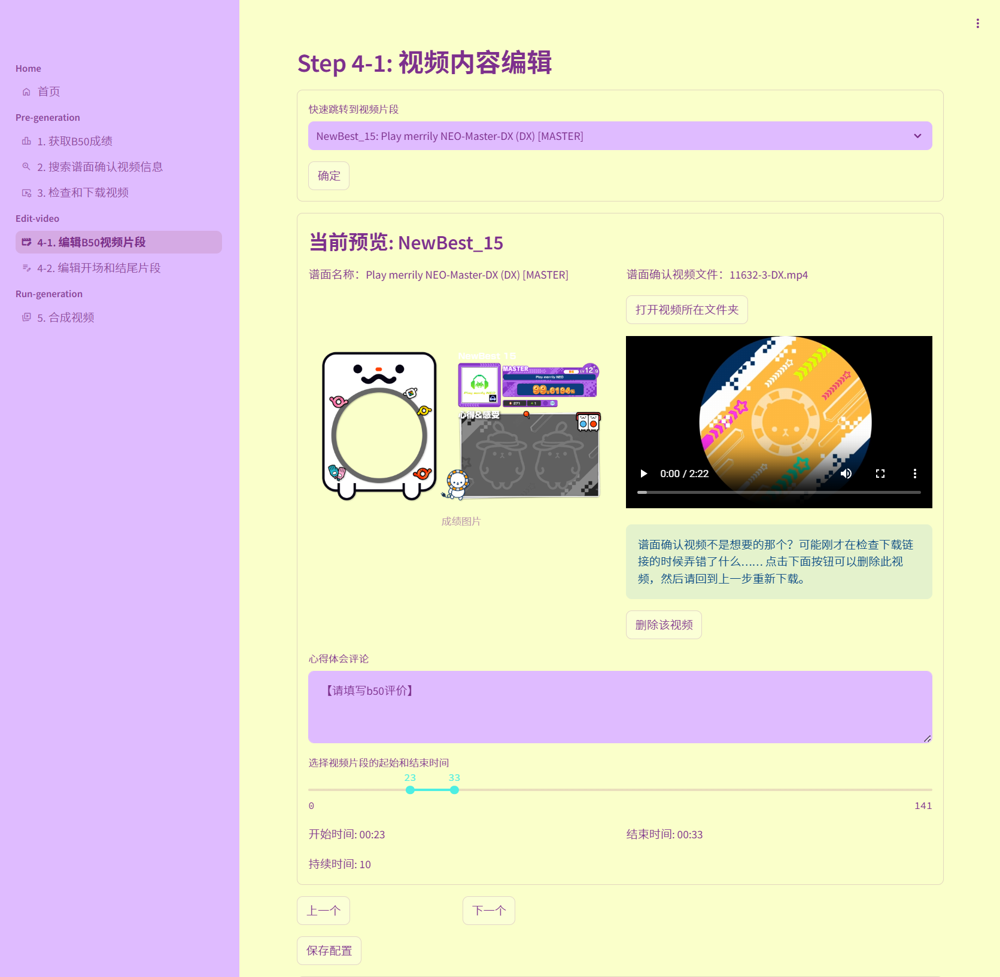
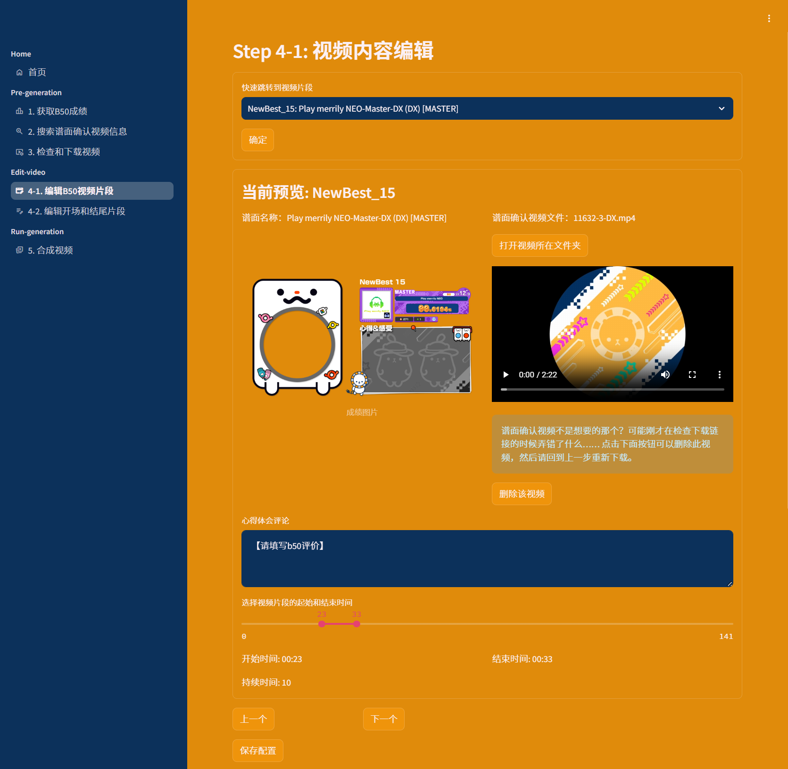
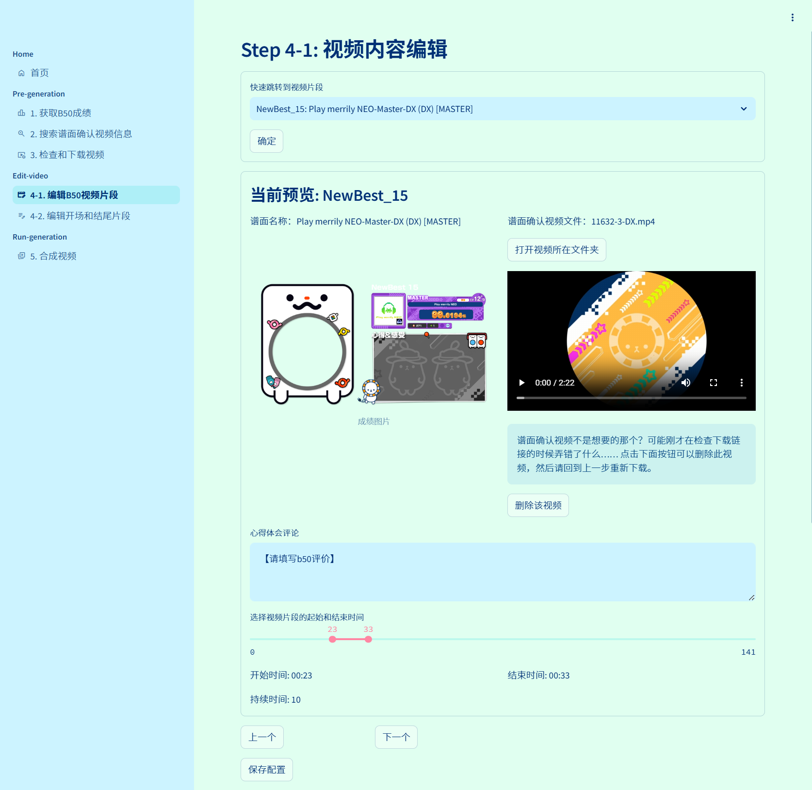
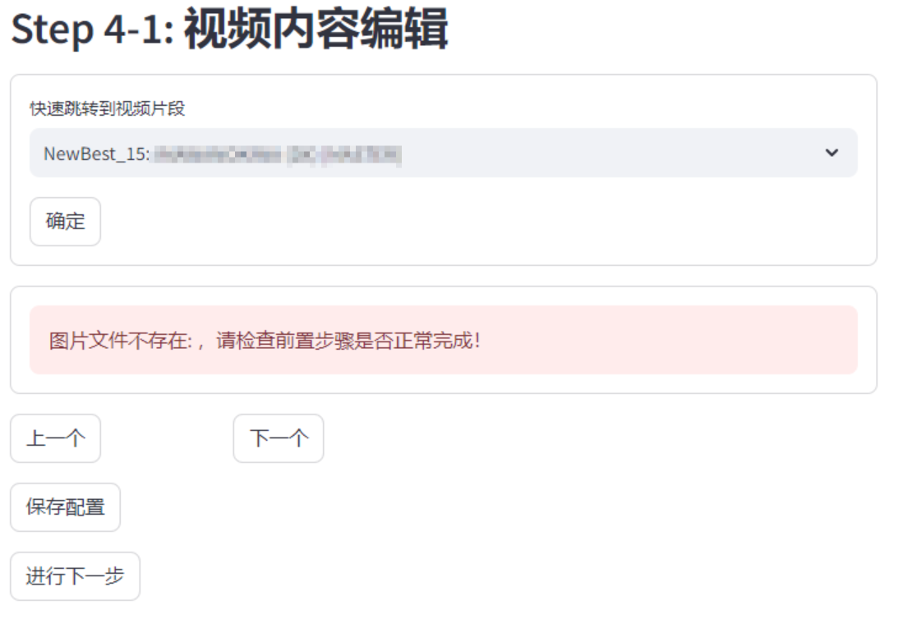

# mai-gen-videob50

自动从流媒体上搜索并构建你的舞萌DX B50视频

Auto search and generate your best 50 videoes of MaimaiDX

## 更新速览

我们预先更新了`v0.5-beta`版本，现在支持以下内容：
- 自定义你自己的B50存档！
- 歌曲数据全部从服务器获取！大幅减小包体体积并支持热更新歌曲数据。
- 但是！因为数据格式的更新，旧版本存档可能会出现不兼容的问题（已经很努力地兼容了.jpg）
    - 因此，建议从全新开始使用新版本，如果要迁移旧版存档，请小心使用并注意备份存档！
    - 新版本还需要进行大量测试，如果遇到使用问题，请多多反馈bug！

## 快速开始

- 对于大多数无编程基础的用户，请**从右侧Release页面下载最新的**打包版本。
- 注意！从`v0.5-beta`版本开始，运行环境包已经和本体分离，要启动应用，请进行以下操作：
    - 下载本体Release包和运行环境包（`runtime_v<版本号>.zip`），并解压
    - 将运行环境包中的**全部文件**，复制到本体Release包解压后的目录
    - 双击`start.bat`文件启动应用。
    - 请不要使用旧版本的runtime运行环境，其缺少新版本的依赖
- 请注意：**打包版本仅支持Windows10及以上操作系统**
- 首次启动时，如果没有立刻弹出浏览器窗口，请检查控制台，如果要求输入Email，请直接回车跳过即可。
- 遇到问题请参考[常见问题](#常见问题)一节。

> 如果你具有基本的计算机和python知识，可以独立（或者GPT辅助）完成环境配置和脚本操作，可以直接clone仓库代码，参考[使用说明](#使用说明（从源代码启动）)部分开始使用。

## 效果预览

- 用户界面（支持主题换色）

|  |  |  |
|:---:|:---:|:---:|
| FES | BUD | PRI |

生成视频效果展示：[【舞萌2024/工具发布】还在手搓b50视频？我写了一个自动生成器！](https://www.bilibili.com/video/BV1bJi2YVEiE)

使用教程视频：[【舞萌2024】新版B50视频生成器来啦！支持一键启动/站内下载/全面升级用户界面~](https://www.bilibili.com/video/BV1G2kBY5Edq)

- 生成视频帧效果


## 特性

本工具的原理是：

- 从查分器获取你的B50数据，并保存在本地。

- 从流媒体上搜索并下载谱面确认视频，并保存在本地。

- 用户（你）编辑视频里要展示的内容，包括片段长度、评论等。

- 自动根据已缓存的素材合成视频。

查分器源支持情况：

- [x] [水鱼查分器](https://www.diving-fish.com/maimaidx/prober/)：请注意在个人选项中关闭掩码，并允许公开获取你的B50数据。

- [x] [国际服Maimai DX NET](https://maimaidx-eng.com/maimai-mobile/home/ratingTargetMusic/)

- [x] [日服Maimai DX NET](https://maimaidx.jp/maimai-mobile/home/ratingTargetMusic/) (缺乏测试样本)

- [x] [DXrating](https://dxrating.net/rating)：支持国服/国际服/日服

    （国际服/日服官网以及DXrating网站导入数据需要通过下载网页或导出源码，点此查看[国际服/日服数据获取插件使用教程](docs/DX_NET_Guide.md)）

- [ ] [落雪查分器](https://maimai.lxns.net/)（暂未支持）

流媒体源支持情况：

- [x] [youtube](https://www.youtube.com/)

- [x] [bilibili](https://www.bilibili.com/)

计划特性开发情况：

- [x] 可交互的全流程界面（streamlit）

- [x] 支持一键更换页面主题配色

- [x] 更好的B50数据存档系统，可以保存多个历史副本

- [x] 支持自行筛选的B50数据、自定义视频生成的列表（支持从水鱼自动获取AP B50）

- [ ] 支持自定义视频背景图片、字体和字号等个性化功能

- [ ] （远期）支持 中二B30/音击B45 视频生成

---

## 使用说明（从源代码启动）

1. 安装python环境和依赖，推荐使用 `conda`。注意，python版本需要3.10以上。

    ```bash
    conda create -n mai-gen-videob50 python=3.10
    conda activate mai-gen-videob50
    ```

2. 从 requirements.txt 安装依赖

    ```bash
    pip install -r requirements.txt
    ```
    > 注意，如果你使用linux系统，在登陆b站过程中需要弹出tkinter窗口。而在linux的python没有预装`tk`库，请自行使用`sudo apt-get install python3-tk`安装。

3. 安装ffmpeg（如果从Release包中下载，则无需此步骤）：

    - Windows:

        从 [CODEX FFMPEG](https://www.gyan.dev/ffmpeg/builds/) 下载 `ffmpeg-release-essentials.zip` 文件，解压文件到你的电脑上的任意目录后，将 `bin` 目录所在路径添加到系统环境变量中。

    - Linux:

        使用`sudo apt-get install ffmpeg`安装ffmpeg。

    
4. 使用下面的命令启动streamlit网页应用

    ```
    streamlit run st_app.py
    ```
    在网页运行程序时，请保持终端窗口打开，其中可能会输出有用的调试信息。
    
#### 其他注意事项

- 如果你使用youtube源且使用代理下载，你可能会遇到风控情况，此时请额外按照youtube的 po token生成相关依赖，具体请参考：[使用自定义OAuth或PO Token](docs/UseTokenGuide.md)

- 如果你使用国际服/日服，或使用DXrating网站作为B50数据源，在使用前请参考：[导入国际服/日服B50数据](docs/DX_NET_Guide.md)完成前置数据获取步骤。

---

## 常见问题

### 安装环境相关

- 出现`ModuleNotFoundError: No module named 'moviepy'`等报错

    请检查你是否已经配置好3.10版本以上的python环境，并安装了`requirements.txt`中的所有依赖。

- 出现类似如下的报错：

    ```
    OSError: [WinError 2] The system cannot find the file specified

    MoviePy error: the file 'ffmpeg.exe' was not found! Please install ffmpeg on your system, and make sure to set the path to the binary in the PATH environment variable
    ```

    请检查你的python环境和`ffmpeg`是否安装正确，确保其路径已添加到系统环境变量或项目根目录中。

### 视频抓取相关

- 网络链接问题

    ```
    [WinError 10060] 由于连接方在一段时间后没有正确答复或连接的主机没有反应，连接尝试失败。
    ```

    请检查网络连接。如果你使用代理，请检查是否在选择了代理开启的情况下没有打开代理，或代理服务是否正常。


- 下载视频过程中出现RemoteProtocolError或SSLEOFError异常：

   - RemoteProtocolError
    ```
    httpx.RemoteProtocolError: peer closed connection without sending complete message body
    ```
    - SSLEOFError / urlopen error

    ```
    <urlopen error [Errno 2] No such file or directory>
    ```

    ```
    ssl.SSLEOFError: EOF occurred in violation of protocol (_ssl.c:2423)
    ```

    请重新进入第三步下载页面，直接点击下载视频即可，支持断点续传。

- 搜索和下载视频期间出现风控问题：

    - 使用youtube下载器时，被风控将输出如下错误：

    ```
    This request was detected as a bot. Use use_po_token=True to view. 
    ```
    说明你使用的ip地址可能被youtube识别为机器人导致封禁，最简单的办法是尝试更换代理ip后重试。

    如果更改代理仍然无法解决问题，请尝试配置`PO_TOKEN`或`OAUTH_TOKEN`后抓取视频，这部分需要额外的环境配置和手动操作，请参考[使用自定义OAuth或PO Token](UseTokenGuide.md)。

    - 使用bilibili下载器时，被风控将输出如下错误：

    ```
    搜索结果异常，请检查如下输出：'v_voucher': 'voucher_xxxxxxxxx-xxxx-xxxx-xxxx-xxxxxxxx'
    ```
    说明你未使用bilibili账号登录，或登录后遭到风控。

    如果登陆账号后仍出现此问题，目前没有较好的解决办法，请考虑等待24h后再试。

- 下载视频期间未报错，但是没有视频文件：
  
    - 请检查ffmpeg环境是否正确配置。

- 手动输入视频BV号或ID进行搜索时出现红色报错：

    - 请尝试删除输入框开头的BV字母。

### 配置填写相关

- Q：加载页面4-1时，提示图片文件或视频文件不存在

    

    请检查是否完成了第1-3步中的图片生成以及视频下载等全步骤。
    
    如果确认已经完成并可以在本地文件夹中找到图片和视频，则按照以下步骤操作：

    - 进入页面下方`危险区域`一栏
    - 点击`强制刷新视频配置文件`按钮

    （注意：此操作将会重置你已经填写的所有评论，如果你在还未填写任何评论的时候遇到该问题，可以进行该操作。否则，请参考下一问）

    


- Q：我先填写了部分评论，但是后来B50数据更新了，怎么更新评论？

    视频配置信息不会随B50数据的更新而自动更新，建议b50推分后建立一个新的存档。如果确实需要复制部分旧存档的评论，请参考如下步骤：

    - 首先新建存档更新b50，在第1-3步将你的B50数据和视频搜索数据都更新到最新。

    - 保持当前编辑的页面不动，复制浏览器中的地址，打开一个新的页面，以加载历史存档。
    
    - 进入页面4-1并对比两个页面的信息以复制粘贴评论内容，手动还原评论和时长配置

- Q：我不小心更新了B50数据，但是我还想要使用旧的B50数据生成视频

    - 如果您使用的是`v0.4.0`以上的版本，每次更新数据（强制覆盖除外）将会自动新建存档，只需在首页加载历史存档继续编辑即可。
    

### 视频生成相关

- Q：视频生成过程中中断，并提示无法读取某视频文件

    ```
    ffmpeg_read: ...\videos\downloads\xxx-x-xx.mp4, 3 bytes wanted but 6 bytes read at frame index 0 (ouf of a total of xx frames) 0.00 sec, Using the last valid frame instead.
    ```

    请检查错误信息中输出的视频名称（如`xxxx-x-xx.mp4`），在`./videos/downloads`文件夹下检查是否存在该文件，且该视频是否可以正常播放。

    如果该视频无法播放，可能意味着下载过程中视频损坏。请删除该视频文件，重新进入第3步下载。
    
    如果重新下载后依然得到损坏的视频，那么该视频的在线媒体流可能存在问题，请考虑回到第2步，更换其他链接源。
    
    > 亦可手动获取对应的正确视频，替换到`./videos/downloads`文件夹下，请注意保持文件名一致。

- Q：视频生成过程中中断，出现如下内存错误

    ```
    _ArrayMemoryError: Unable to allocate xxx MiB for an array with shape (1920, 1080, 3) and data type float64
    ```

    这通常是由于ffmpeg没有被分配足够的内存导致的，由于B50视频的时长通常较长，且默认分辨率为高清，部分设备可能会出现内存瓶颈。

    请考虑：
    
    - 清理系统运行内存，关闭暂时不使用的后台程序后重试。
    - 缩减片段的预览时长，或降低视频分辨率（不推荐，可能导致文字错位）。
    - 增加系统的虚拟内存（请参考：[如何设置虚拟内存](https://www.bilibili.com/video/BV1a142197a9)），建议可以调整至32GB以上。

- Q：视频生成过慢

    合并完整视频的时间取决于你设置的预览时长和设备的性能，在每个片段10s的情况下，生成完整视频大概需要60-100分钟。
    
    如果设备性能不佳，请考虑缩减视频时长，或降低视频分辨率（不推荐，可能导致文字错位）


- Q：生成视频最后出现如下控制台错误

    ```
    if _WaitForSingleObject(self._handle, 0) == _WAIT_OBJECT_0:
                        ^^^^^^^^^^^^^^^^^^^^^^^^^^^^^^^^^^^^^^
    OSError: [WinError 6] 句柄无效。
    ```

    这是因为ffmpeg没有正常关闭视频文件导致的，但该问题不影响最终视频生成，可以忽略。

---

## 参数与配置文件结构

如果你有兴趣贡献本仓库，或是希望了解本工具的详细结构，请参考以下内容。

### 全局应用参数的解释

在 `global_congfig.yaml` 文件可更改本应用的所有外部配置：

- `DOWNLOAD_HIGH_RES` ：设置为是否下载高分辨率视频（开启后尽可能下载1080p的视频，否则最高下载480p的视频），默认为`true`。

- `NO_BILIBILI_CREDENTIAL` ：使用bilibili下载器时，是否禁用bilibili账号登录，默认为`false`。

    > 注意：使用bilibili下载器默认需要账号登录。不使用账号登录可能导致无法下载高分辨率视频，或受到风控

- `USE_CUSTOM_PO_TOKEN, USE_AUTO_PO_TOKEN, USE_OAUTH, CUSTOMER_PO_TOKEN` ：设置使用youtube下载器抓取视频时的额外验证Token。

    > 请参考文档[使用自定义OAuth或PO Token](UseTokenGuide.md)。

- `SEARCH_MAX_RESULTS` ：设置搜索视频时，最多搜索到的视频数量。

- `SEARCH_WAIT_TIME` ：设置搜索和下载视频时，每次调用API后等待的时间，格式为`[min, max]`，单位为秒。

- `VIDEO_RES` ：设置输出视频的分辨率，格式为`(width, height)`。

- `VIDEO_TRANS_ENABLE` ：设置生成完整视频时，是否启用视频片段之间的过渡效果，默认为`true`，会在每个视频片段之间添加过渡效果。

- `VIDEO_TRANS_TIME` ：设置生成完整视频时，两个视频片段之间的过渡时间，单位为秒。

- `USE_ALL_CACHE` ：生成图片和视频需要一定时间。如果设置为`true`，则使用本地已经生成的缓存，从而跳过重新生成的步骤，推荐在已经获取过数据但是合成视频失败或中断后使用。如果你需要从水鱼更新新的b50数据，请设置为`false`。

- `ONLY_GENERATE_CLIPS` ：设置为是否只生成视频片段，如果设置为`true`，则只会在`./videos/{USER_ID}`文件夹下生成每个b的视频片段，而不会生成完整的视频。

- `CLIP_PLAY_TIME` ：设置生成完整视频时，每段谱面确认默认播放的时长，单位为秒。

- `CLIP_START_INTERVAL` ：设置生成完整视频时，每段谱面确认默认开始播放的时间随机范围，格式为`[min, max]`，单位为秒。

### 本地存档文件结构的解释

> 注意：本部分内容在v0.5版本以后已经过时，有待进行更新完善，旧版内容仅供参考！

- 在`./b50_datas`文件夹下是所有的用户b50存档，以及与其配对的视频搜索和生成配置文件

    - 用户存档以时间戳命名，作为子文件夹，例如`./b50_datas/{user}/20250101_080011`是用户在2025.1.1 08:00:11创建的存档

    - 每个存档文件夹中包含：

        - `b50_raw.json` ：用户的原始b50数据，由查分器返回，目前统一采用水鱼API的格式

        - `b50_config_{DOWNLOADER}.json` ：用户的b50数据与每个谱面的目标流媒体视频数据的映射。
            - 其中无后缀的文件是空映射，为了使得用户更新b50数据时，不会覆盖已有的配置文件。
            - 后缀为`_downloader`的文件为下载器自动生成，存储不同平台搜索到的视频信息和备选视频信息。

        - `video_config.json` ：自动生成的视频渲染的配置文件，包括生成器索引的图片和视频位置，以及用户填写的评论和片段时长配置。
            - 注意本文件不含有视频链接等互联网信息，仅记录本地映射。因此删除本文将不影响搜索和下载，但是会影响已填写的评论和片段时长。

        - `images`文件夹，存储所有生成的成绩图片，以`{PastBest/NewBest}_{id}.png`的格式命名。

        - `videos`文件夹，存储输出的视频
    
    - 如果用户以复制源码方式导入数据，输入的html或json源码不会保存在存档内，而是作为缓存保存在`./b50_datas/{user}`文件夹下，新的原始数据会覆盖这些文件，但存档内的数据保持不变（除非用户手动修改或覆盖）

- 在`./videos/downloads`文件夹下可以找到所有已下载的谱面确认视频，命名格式为`{song_id}-{level_index}-{type}.mp4`。其中，`song_id`为曲目的ID，`level_index`为难度，`type`为谱面类型，例如`834-4-SD.mp4`。
    
    - 您可能会见到具有负数`song_id`的视频文件，这是由于数据库缺少一些较新曲目id导致的，在单次使用时一般不会产生问题。在多次使用时，这可能导致视频索引错误，请删除对应的视频文件已解决这样的问题。

`video_config.json`的详细格式解释：

 - "intro"和"ending"部分你填写的text会作为开头和结尾的文字展示。"main"部分填写的text为每条b50下的文字展示。

 - 输入的文字会根据模板长度自动换行

 - "intro"和"ending"部分均可以添加多页，例如：

```json
"intro": [
    {
        "id": "intro_1",
        "duration": 10,
        "text": "【前言部分第一页】"
    },
    {
        "id": "intro_2",
        "duration": 10,
        "text": "【前言部分第二页】"
    }
],
"ending": [
    {
        "id": "ending_1",
        "duration": 10,
        "text": "【后记部分第一页】"
    },
    {
        "id": "ending_2",
        "duration": 10,
        "text": "【后记部分第二页】"
    }
],
```
- "main"的部分暂不支持多页文字。"main"部分的示例如下：

```json
"main": [
    {
        "id": "NewBest_1",
        "achievement_title": "系ぎて-re:Master-DX",
        "song_id": 11663,
        "level_index": 4,
        "type": "DX",
        "main_image": "b50_images\\test\\PastBest_1.png",
        "video": "videos\\test\\11663-4-DX.mp4",
        "duration": 9,
        "start": 49,
        "end": 58,
        "text": "【请填写b50评价】\n【你只需要填写这条字符串】"
    },
]
```


## 鸣谢

- [舞萌 DX 查分器](https://github.com/Diving-Fish/maimaidx-prober) 提供数据库及查询接口

- [Tomsens Nanser](https://space.bilibili.com/255845314) 提供图片生成素材模板以及代码实现

- [bilibili-api](https://github.com/Nemo2011/bilibili-api) 
