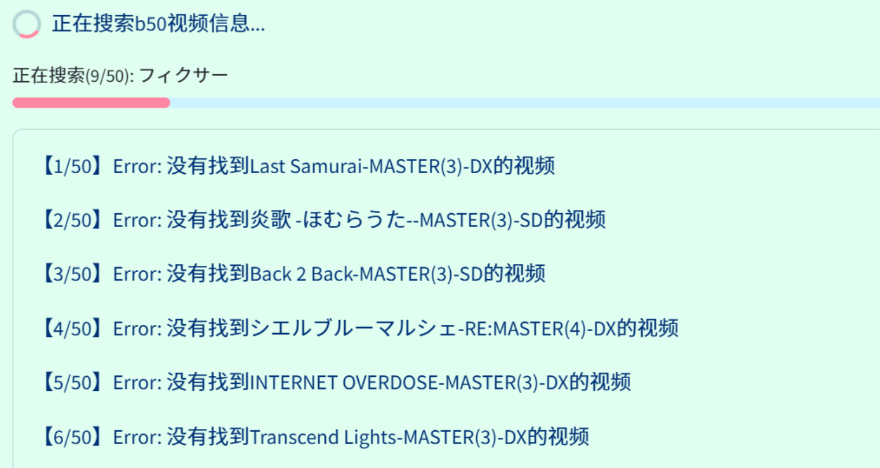

# mai-gen-videob50(+chu) 分表视频生成器

自动从流媒体上搜索并构建你的舞萌DX / 中二节奏 Best分表视频

Auto search and generate your best videos of MaimaiDX / Chunithm

## 更新速览

`v1.0` 测试版本现已更新：
- ✨ **重大更新**：现已支持中二节奏（CHUNITHM）B50视频生成！并统一支持了水鱼查分器和落雪查分器的双数据源更新
    - 中二节奏的国际服数据查询还在施工中，敬请谅解
- 🛠️ 数据库重构：使用本地Sqlite3数据库替换原基于文件的数据存储系统，在调取资源时更加灵活，并兼容分表数据的未来更新
- 🎮 界面更新：更加友好的控件布局和和流程导航，在使用不同生成模式时自动切换配色方案
- 🔍 搜索优化：支持使用YouTube Data API v3进行搜索（您需要自行获取api密钥），并优化更加快捷的手动搜索流程

由于数据库支持更新，`v1.0`版本需要重新开始使用，旧版本数据暂时不能迁移，敬请谅解。

- 如果您需要更快速度地制作中二分表，可以参考由 [〖天蓝〗](https://github.com/MetallicAllex) 制作的渲染改进版分支 [chu-gen-videob30](https://github.com/MetallicAllex/chu-gen-videob30/tree/get_userdata_FC)

---

## 快速开始

- 获取打包版本：**从右侧Release页面下载最新版本**。
- 您需要下载两个压缩包，运行环境包和本体分离，进行以下操作：
    - 下载本体压缩包（`maigen_release_v<版本号>.zip`）和运行环境包（`runtime_v<版本号>.zip`），并解压
    - 将**运行环境包**中的**全部文件**，复制到**本体包解压后的目录**，覆盖同名文件
    - 双击`start.bat`文件启动应用。
    - 请不要使用旧版本的runtime运行环境，其缺少新版本的依赖
- 请注意：**打包版本仅支持Windows10及以上操作系统**
- 首次启动时，如果没有立刻弹出浏览器窗口，请检查控制台，如果要求输入Email，请直接回车跳过即可。
- 遇到问题请参考[常见问题](#常见问题)一节。

> 如果你具有基本的计算机和python知识，可以独立（或者LLM辅助）完成环境配置和脚本操作，可以直接clone仓库代码，参考[安装说明](#安装说明（从源代码启动）)部分开始使用。

## 效果预览

- 用户界面（支持主题换色）

|  |  |  |
|:---:|:---:|:---:|
| maimai Prism | maimai  Circle | Chunithm Verse |

生成视频效果展示：
- [【舞萌2024/工具发布】还在手搓b50视频？我写了一个自动生成器！](https://www.bilibili.com/video/BV1bJi2YVEiE)

- [【中二节奏2026】小伙时隔半个月成功抵达虹分，这是他分表发生的变化](https://www.bilibili.com/video/BV1m9yVBfExq)

- 生成视频帧效果

|  |  |
|:---:|:---:|
| maimai  | Chunithm |


## 特性

### 查分器源支持情况

- [x] [水鱼查分器](https://www.diving-fish.com/maimaidx/prober/)：请注意在个人选项中关闭掩码，并允许公开获取你的B50数据。

- [x] [落雪查分器](https://maimai.lxns.net/)：直接通过好友码获取（请在账户设置中打开相关权限）。如果您不愿意授权开发者读取，可选择填入落雪后台生成的个人 API KEY 拉取数据。

> 注：以下源支持已过期，无法保证可用性

- [x] Maimai DX NET： [国际服](https://maimaidx-eng.com/maimai-mobile/home/ratingTargetMusic/)/[日服](https://maimaidx.jp/maimai-mobile/home/ratingTargetMusic/) 

- [x] [DXrating](https://dxrating.net/rating)：支持国服/国际服/日服

国际服/日服官网以及DXrating网站导入数据需要通过下载网页或导出源码，点此查看[国际服/日服数据获取插件使用教程](docs/DX_NET_Guide.md)）


### 流媒体源支持情况

- [x] [youtube](https://www.youtube.com/)：支持 YouTube Data API v3 和 pytubefix 两种搜索方式

- [x] [bilibili](https://www.bilibili.com/)

### 已实现特性

- [x] 可交互的全流程界面（streamlit）

- [x] 支持一键更换页面主题配色

- [x] 更好的存档系统，可以保存多个历史副本，已经对应媒体信息

- [x] 支持自行筛选分表数据、自定义视频生成的列表（支持自动获取AP B50）

- [x] 支持自定义视频背景图片、字体和字号等个性化功能

- [x] 支持中二节奏B30视频生成

---

## 安装说明（从源代码启动）

1. 安装python环境和依赖，推荐使用 `conda`。注意，python版本需要3.10以上。

    ```bash
    conda create -n mai-chu-gen-video python=3.10
    conda activate mai-chu-gen-video
    ```

2. 从 requirements.txt 安装依赖

    ```bash
    pip install -r requirements.txt
    ```
    > 注意，如果你使用linux系统，在登陆b站过程中需要弹出tkinter窗口。而在linux的python没有预装`tk`库，请自行使用`sudo apt-get install python3-tk`安装。

3. 安装ffmpeg（如果从Release包中下载，则无需此步骤）：

    - Windows:

        从 [CODEX FFMPEG](https://www.gyan.dev/ffmpeg/builds/) 下载 `ffmpeg-release-essentials.zip` 文件，解压文件到你的电脑上的任意目录后，将 `bin` 目录所在路径添加到系统环境变量中。

    - Linux:

        使用`sudo apt-get install ffmpeg`安装ffmpeg。

4. 使用下面的命令启动streamlit网页应用

    ```bash
    streamlit run st_app.py
    ```
    在网页运行程序时，请保持终端窗口打开，依照页面指引使用即可

---

## 常见问题

### 安装环境相关

- 出现`ModuleNotFoundError: No module named 'moviepy'`等报错

    请检查你是否已经配置好3.10版本以上的python环境，并安装了`requirements.txt`中的所有依赖。

- 出现类似如下的报错：

    ```
    OSError: [WinError 2] The system cannot find the file specified

    MoviePy error: the file 'ffmpeg.exe' was not found! Please install ffmpeg on your system, and make sure to set the path to the binary in the PATH environment variable
    ```

    请检查你的python环境和`ffmpeg`是否安装正确，确保其路径已添加到系统环境变量或项目根目录中。

### 视频抓取相关

- 搜索视频步骤中，扫码登录后出现如下报错：

    

    请检查任务栏是否有未关闭的二维码扫描窗口，如果有，关闭该窗口后尝试重新开始搜索。如果弹出了新的二维码窗口请重新扫描登陆。如果没有，请尝试重新整个程序重试。

- 搜索和下载视频时出现大量失败信息：

    

    这通常意味着您的网络环境在调用api时遇到风控问题。请查看控制台是否有有如下输出。

    - 使用youtube下载器时，被风控将输出如下错误：

    ```
    This request was detected as a bot. Use use_po_token=True to view. 
    ```
    说明你使用的ip地址可能被youtube识别为机器人导致封禁，最简单的办法是尝试更换代理ip后重试。

    如果更改代理仍然无法解决问题，请尝试配置`PO_TOKEN`或`OAUTH_TOKEN`后抓取视频，参考[使用自定义OAuth或PO Token](UseTokenGuide.md)。

    如果仍然被风控请考虑使用 YouTube Data API v3 进行搜索（更稳定可靠）

        - 前往youtube平台申请个人API Key
        - 在"搜索谱面确认视频信息"页面，勾选"使用 YouTube Data API v3 搜索"并填入你的 API Key

    - 使用bilibili下载器时，被风控将输出如下错误：

    ```
    搜索结果异常，请检查如下输出：'v_voucher': 'voucher_xxxxxxxxx-xxxx-xxxx-xxxx-xxxxxxxx'
    ```
    说明你未使用bilibili账号登录，或登录后遭到风控。

    请尝试登陆账号、更换网络运营商（ISP）后重试。若仍出现此问题，目前没有较好的解决办法，请考虑等待24h后再试。

    PS：您也可以跳过自动搜索步骤，使用页面中提供的快捷跳转链接，手动在浏览器中搜索视频，将链接粘贴到输入框中。

- 网络链接问题

    下载视频过程中出现RemoteProtocolError或SSLEOFError异常，或http超时报错：

   - RemoteProtocolError
    ```
    httpx.RemoteProtocolError: peer closed connection without sending complete message body
    ```
    - SSLEOFError / urlopen error

    ```
    <urlopen error [Errno 2] No such file or directory>
    ```

    ```
    ssl.SSLEOFError: EOF occurred in violation of protocol (_ssl.c:2423)
    ```

    通常只是网络波动，重新尝试搜索/下载即可。

### 配置填写相关

- Q：加载页面4-1时，提示 "找不到对应的图片/视频文件" 

    如果您在完成视频生成前清理了本地下载的缓存文件，可能出现此问题

    解决方法：
    - **刷新页面**：最简单的方法是刷新当前页面，重新加载媒体文件
    - **检查文件路径**：确认视频文件确实存在于本地，且路径正确
    - **重新下载视频**：如果文件确实丢失，请返回第1步重新生成图片，或第3步重新下载视频

- Q：我不小心更新了B50/B30数据，但是我还想要使用旧的数据生成视频

    - 您在每次查询查分器数据时会自动新建存档，只需在首页加载历史存档继续编辑即可。
    

### 视频生成相关

- Q：**视频生成过程中中断，报错中出现如下内存错误**

    

    ```
    _ArrayMemoryError: Unable to allocate xxx MiB for an array with shape (xxx, xxx, 3) and data type float64
    ```

    这通常是由于ffmpeg没有被分配足够的内存导致的，由于完整生成模式需要一次缓存约50段视频的图像张量，且默认分辨率为高清，部分设备可能会出现内存瓶颈。

    请考虑：
    
    - 清理系统运行内存，关闭暂时不使用的后台程序后重试。
    - 缩减片段的预览时长，或降低视频分辨率（不推荐，可能导致文字错位）。
    - 增加系统的虚拟内存（请参考：[如何设置虚拟内存](https://www.bilibili.com/video/BV1a142197a9)），建议可以调整至32GB以上。

- Q：视频生成速度缓慢

    合并完整视频的时间取决于你设置的预览时长和设备的性能，在每个片段10s的情况下，生成完整视频至少需要60分钟。

    本工具的性能瓶颈主要是CPU性能，由于依赖的第三方库特性，**目前无法实现GPU加速渲染**，敬请谅解。
    
    如果您的CPU性能不佳，该时间可能会延长到3小时甚至以上，请考虑缩减视频时长，或降低视频分辨率（不推荐，可能需要手动调整字号以防止文字错位）

    >  如果您在制作中二分表，[〖天蓝〗](https://github.com/MetallicAllex) 在本项目v0.6.5版本的基础上开发了优化ffmepg渲染速度的改进版分支 [chu-gen-videob30](https://github.com/MetallicAllex/chu-gen-videob30/tree/get_userdata_FC)，确实需要更快渲染速度的情况下，可以参考该分支。

- Q：视频生成过程中中断，并提示无法读取某视频文件

    ```
    ffmpeg_read: ...\videos\downloads\xxx-x-xx.mp4, 3 bytes wanted but 6 bytes read at frame index 0 (ouf of a total of xx frames) 0.00 sec, Using the last valid frame instead.
    ```

    请检查错误信息中输出的视频名称（如`xxxx-x-xx.mp4`），在`./videos/downloads`文件夹下检查是否存在该文件，且该视频是否可以正常播放。

    如果该视频无法播放，可能意味着下载过程中视频损坏。请删除该视频文件，重新进入第3步下载。
    
    如果重新下载后依然得到损坏的视频，那么该视频的在线媒体流可能存在问题，请考虑回到第2步，更换其他链接源。
    
    > 您还可以考虑在4-1页面中手动上传本地文件，以替换无法解码的流媒体文件。

- Q：生成视频最后出现如下控制台错误

    ```
    if _WaitForSingleObject(self._handle, 0) == _WAIT_OBJECT_0:
                        ^^^^^^^^^^^^^^^^^^^^^^^^^^^^^^^^^^^^^^
    OSError: [WinError 6] 句柄无效。
    ```

    这是因为ffmpeg没有正常关闭视频文件导致的，但该问题不影响最终视频生成，可以忽略。
---

## 参数与配置文件结构

如果你有兴趣贡献本仓库，或是希望了解本工具的详细结构，请参考以下内容。

### 全局应用参数的解释

在 `global_congfig.yaml` 文件可更改本应用的所有外部配置：

- `DOWNLOAD_HIGH_RES` ：设置为是否下载高分辨率视频（开启后尽可能下载1080p的视频，否则最高下载480p的视频），默认为`true`。

- `NO_BILIBILI_CREDENTIAL` ：使用bilibili下载器时，是否禁用bilibili账号登录，默认为`false`。

- `USE_CUSTOM_PO_TOKEN, USE_AUTO_PO_TOKEN, USE_OAUTH, CUSTOMER_PO_TOKEN` ：设置使用youtube下载器抓取视频时的额外验证Token。

- `USE_YOUTUBE_API` ：是否使用 YouTube Data API v3 进行搜索，默认为`false`。推荐设置为`true`以获得更稳定的搜索体验。

- `YOUTUBE_API_KEY` ：YouTube Data API v3 的 API Key。如果`USE_YOUTUBE_API`为`true`，需要填写此字段。

- `SEARCH_MAX_RESULTS` ：设置搜索视频时，最多搜索到的视频数量。

- `SEARCH_WAIT_TIME` ：设置搜索和下载视频时，每次调用API后等待的时间，格式为`[min, max]`，单位为秒。

- `VIDEO_RES` ：设置输出视频的分辨率，格式为`(width, height)`。

- `VIDEO_TRANS_ENABLE` ：设置生成完整视频时，是否启用视频片段之间的过渡效果，默认为`true`，会在每个视频片段之间添加过渡效果。

- `VIDEO_TRANS_TIME` ：设置生成完整视频时，两个视频片段之间的过渡时间，单位为秒。

- `USE_ALL_CACHE` ：生成图片和视频需要一定时间。如果设置为`true`，则使用本地已经生成的缓存，从而跳过重新生成的步骤，推荐在已经获取过数据但是合成视频失败或中断后使用。如果你需要从水鱼更新新的b50数据，请设置为`false`。

- `ONLY_GENERATE_CLIPS` ：设置为是否只生成视频片段，如果设置为`true`，则只会在`./videos/{USER_ID}`文件夹下生成每个b的视频片段，而不会生成完整的视频。

- `CLIP_PLAY_TIME` ：设置生成完整视频时，每段谱面确认默认播放的时长，单位为秒。

- `CLIP_START_INTERVAL` ：设置生成完整视频时，每段谱面确认默认开始播放的时间随机范围，格式为`[min, max]`，单位为秒。


## 鸣谢

- [舞萌 DX 查分器](https://github.com/Diving-Fish/maimaidx-prober) 提供数据库及查询接口

- [落雪查分器](https://maimai.lxns.net/) 提供中二节奏数据接口

- [Dxrating](https://github.com/gekichumai/dxrating) 在线网页查分工具

- [otoge DB](https://github.com/zvuc/otoge-db) Online DB viewer for songs in Ongeki, Chunithm, maimai

- 中二落雪查分器支持，YouTube Data API v3和部分界面重构支持，由[caiccu](https://github.com/CAICCU)参与贡献

- 中二视频渲染改进分支，由[〖天蓝〗](https://github.com/MetallicAllex)制作

- [Tomsens Nanser](https://space.bilibili.com/255845314) 提供图片生成素材模板以及代码实现

- [bilibili-api](https://github.com/Nemo2011/bilibili-api)

---

