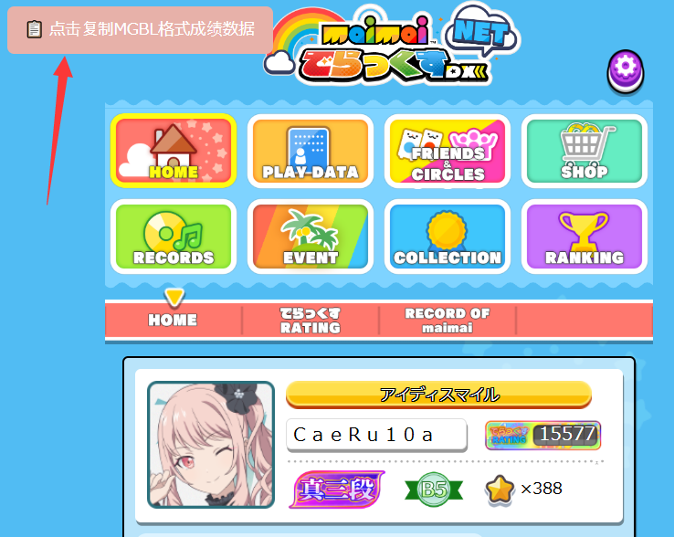
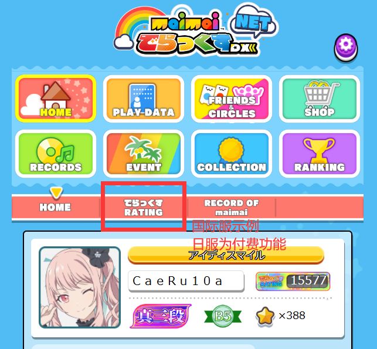
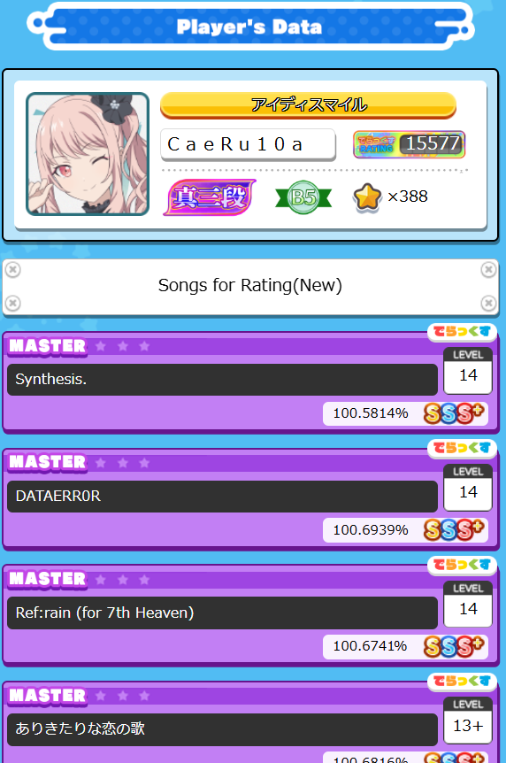

导入数据前请进入并登录对应服务器的官网: \([国际服](https://maimaidx-eng.com)/[日服](https://maimaidx.jp)\)

## 1. 官网-MGBL导出

> 推荐！Mai-gen项目的书签页工具！以下为基础教学，但如果您具有JavaScript相关知识，可以在官网直接运行项目文件夹下`./external_scripts/load_maimai_score.js`中的代码以加载成绩数据。

- 拖动下面这个链接到浏览器书签栏以将其保存为书签，可以随意命名这个书签。

<!--MGBL_LINK-->

> 该链接最后更新于`v1.2.3`版本。如果已保存了最新的书签，可以直接使用。

- 将浏览器切换至官网标签页，然后点击刚刚保存的书签。

- 页面左上角会显示成绩读取进度，读取完毕后会出现数据复制按钮。点击按钮以获取数据文本。

## 2. 官网-HTML导出

- 打开`でらっくすRATING`选项卡。
> 日服maimai DX NET的该功能属于SEGA的付费项目，价格为330円/月。

- 等待B50曲目信息加载完毕后，查看网页的HTML源代码。Windows系统下大部分浏览器为按`Ctrl+U`，不同操作系统、浏览器的方式可能不同。

- 在查看HTML源代码的窗口，复制以`<!DOCTYPE html>`开头的**全部内容**。

## 3. [DXrating](https://dxrating.net/rating)导出

> 截止本文档上次编辑(26年6月4日)，[DXrating网站](https://dxrating.net/rating)在导入成绩时不会读取100.5%(SSS+)以上成绩，但仍可手动添加成绩。在非官方服务器的B50可以考虑在[DXrating网站](https://dxrating.net/rating)手动输入您的B50并导出JSON用于后续生成。

- 打开[DXrating网站](https://dxrating.net/rating)，可以在网页中部右侧找到`导入 / IMPORT`、`导出 / EXPORT`等按钮。点击`导入 / IMPORT`并选择`从NET导入 / Import from offical maimai NET`，然后根据页面指示完成数据导入。

2. 导入完毕后，注意页面中央的maimai logo处选择正确的区服。然后点击`导出 / EXPORT`并选择`导出JSON(仅B50) / Export JSON (Only B50 records)`，浏览器会下载一个名字形如`dxrating.export-{导出时间}.json`的文件，复制其中的内容。

> 打不开Json文件？您可能需要在弹出的打开方式窗口中选择`记事本`，或右键点击`以记事本打开`，或将其后缀改为`.txt`等类似方式。如果都不适用，还请搜索`[您的电脑系统] + 如何打开Json文件`。

> 在大版本更迭期间，或该网站有其他BUG时，导出的B50可能不准确。

## 4. 官网-MTBL导出

> 这个数据源的解析功能会在将来的版本废弃。

- 前往[Maimai Booklet工具页面](https://myjian.github.io/mai-tools/#howto)，按照说明在官网（[国际服](https://maimaidx-eng.com)/[日服](https://maimaidx.jp)）加载该插件。

- 调整导出选项至包含所有内容，读取分数，点击复制`Copy`按钮。