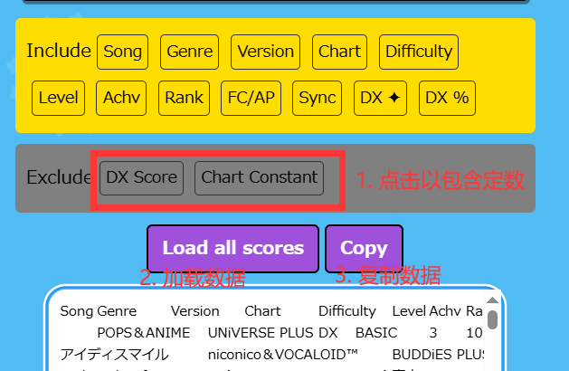

1. 官网-MMBL导出

- 前往[Maimai Booklet工具页面](https://myjian.github.io/mai-tools/#howto)，按照说明在官网（[国际服](https://maimaidx-eng.com)/[日服](https://maimaidx.jp)）加载该插件。

- 调整导出选项至包含所有内容，读取分数，点击复制按钮。

2. 官网-HTML导出

- 在官网（[国际服](https://maimaidx-eng.com)/[日服](https://maimaidx.jp)）打开`でらっくすRATING`选项卡。

- 等待B50曲目信息加载完毕后，查看网页的HTML源代码。Windows系统下大部分浏览器为按`Ctrl+U`，不同操作系统、浏览器的方式可能不同。

- 在查看HTML源代码的窗口，复制以`<!DOCTYPE html>`开头的**全部内容**。

3. dxrating导出

- 听说这个网站年久失修，所以数据导入还没适配