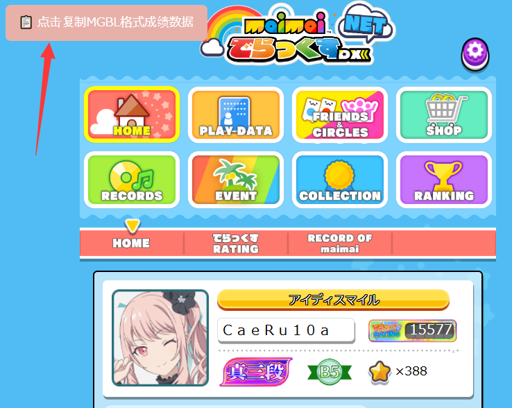
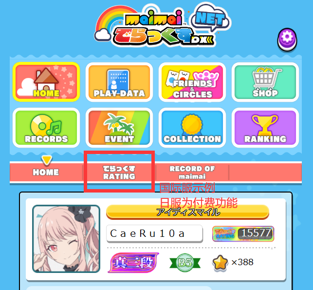
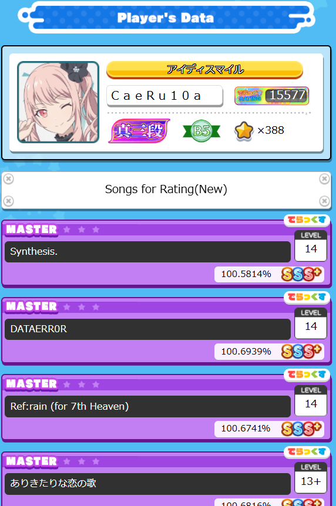

导入数据前请进入并登录对应服务器的官网: \([国际服](https://maimaidx-eng.com)/[日服](https://maimaidx.jp)\)

## 1. 官网-MGBL导出

> Mai-gen项目的书签页工具！这个导入方式可以导入您的全部成绩，并支持特殊筛选。以下为基础教学，但如果您具有JavaScript相关知识，可以在官网直接运行项目文件夹下`./external_scripts/load_maimai_score.js`中的代码以加载成绩数据。

- 拖动下面这个链接到浏览器书签栏以将其保存为书签，可以随意命名这个书签。

<!--MGBL_LINK-->

> 该书签链接最后更新于2026年6月22日的`v1.2.3`版本。如果已保存了最新的书签，可以直接使用。

- 将浏览器切换至官网标签页，然后点击刚刚保存的书签。

- 页面左上角会显示成绩读取进度，读取完毕后会出现数据复制按钮。点击按钮以获取数据文本。

## 2. 官网-HTML导出

> 这个导入方式仅能导入B50曲目。

- 打开`でらっくすRATING`选项卡。
> 日服maimai DX NET的该功能属于SEGA的付费项目，价格为330円/月。

- 等待B50曲目信息加载完毕后，查看网页的HTML源代码。Windows系统下大部分浏览器为按`Ctrl+U`，不同操作系统、浏览器的方式可能不同。

- 在查看HTML源代码的窗口，复制以`<!DOCTYPE html>`开头的**全部内容**。

## 3. [DXrating](https://dxrating.net/rating)导出

> 这个导入方式较为灵活，但需要第三方网站作为中转。在大版本更迭期间或该网站有BUG时，导出的B50可能不准确。

> 这个网站支持导入国服/水鱼/落雪的成绩数据！如果您想按照国际服或日服的B15分割方式计算B50，可以考虑使用该方式进行中转。

- 打开[DXrating网站](https://dxrating.net/rating)，可以在网页中部右侧找到`导入 / IMPORT`、`导出 / EXPORT`等按钮。点击`导入 / IMPORT`并选择`从NET导入 / Import from offical maimai NET`，然后根据页面指示完成数据导入。

- 导入完毕后，注意页面中央的maimai logo处选择正确的区服。然后点击`导出 / EXPORT`并选择需要的JSON类型（推荐仅B50记录），浏览器会下载一个名字形如`dxrating.export-{导出时间}.json`的文件，复制其中的内容。

> 打不开Json文件？您可能需要在弹出的打开方式窗口中选择`记事本`，或右键点击`以记事本打开`，或将其后缀改为`.txt`等类似方式。如果都不适用，还请搜索`[您的电脑系统] + 如何打开Json文件`。

## 4. MuNET导出的JSON文件

> 目前唯一支持的非官方服务器数据导入。受限于本地乐曲元数据，MuNET直接导入时功能比较受限。主要表现为无法识别**国服未实装**曲目的曲名、等级、定数，但仍可保留难度(红/紫/白)、成绩、在B35/B15的顺位以供您于后续步骤手动编辑。

- 从MuNET导出您的成绩JSON，复制其中的内容。（受限于开发者没有相关账号，无法提供更详细的“MuNET JSON导出"教程）

> (3)描述的DXrating网站可以导入MuNET JSON并解析成绩，您可以使用DXrating作为中转、最后使用DXrating导出的JSON作为生成器数据源。这或许可以节约您手动在生成器中编辑曲名、定数、曲绘的时间。

## 5. 官网-MTBL导出（已废弃）

> 由于相关插件的开发者是反动派，这个数据源的解析功能已不再支持。